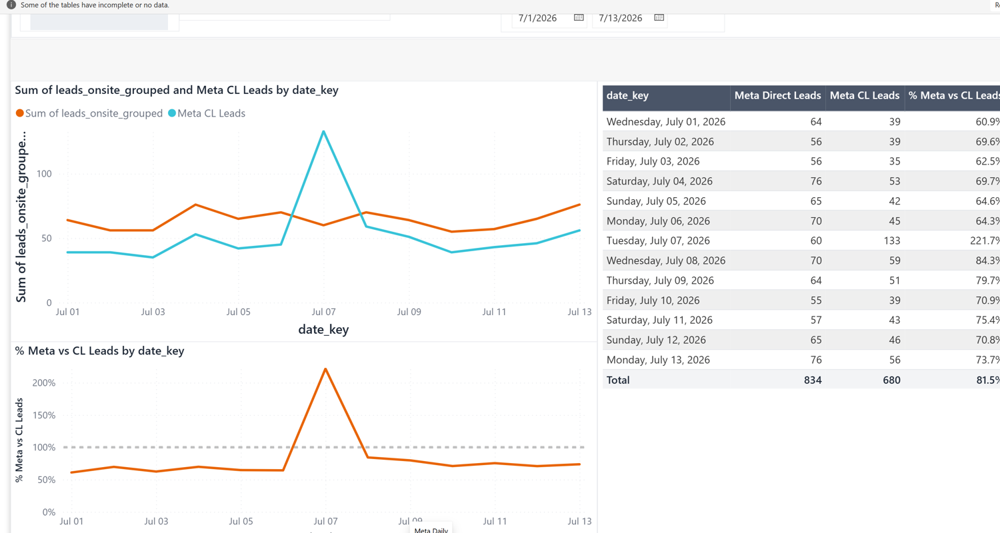
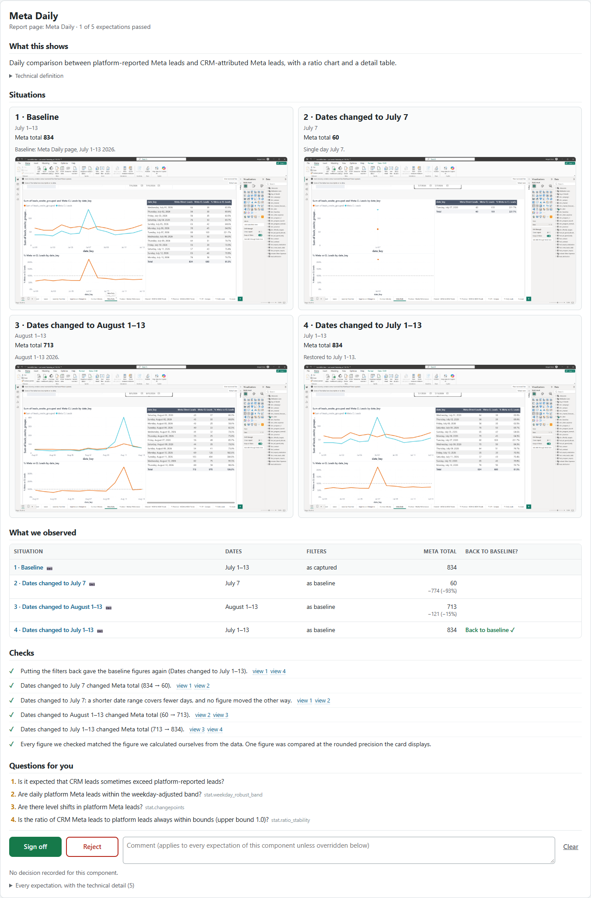
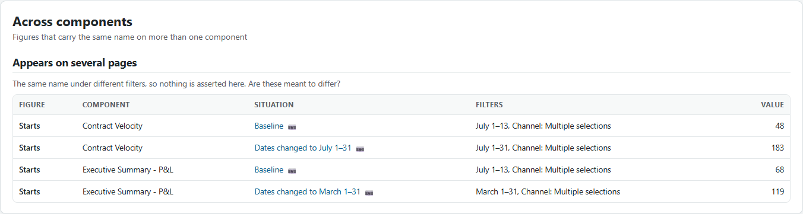
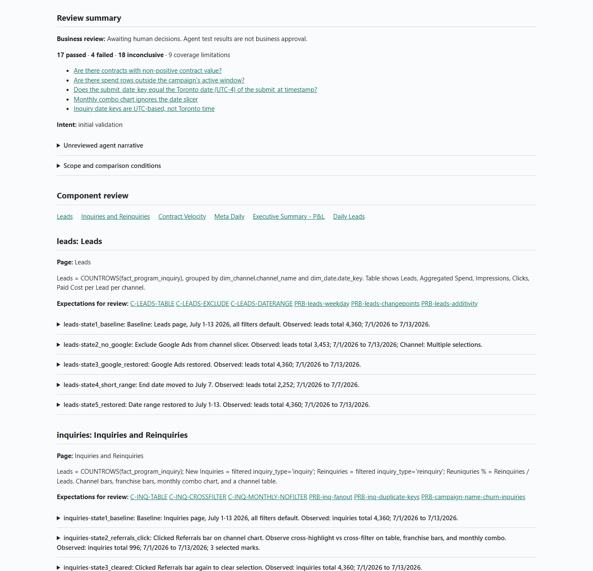
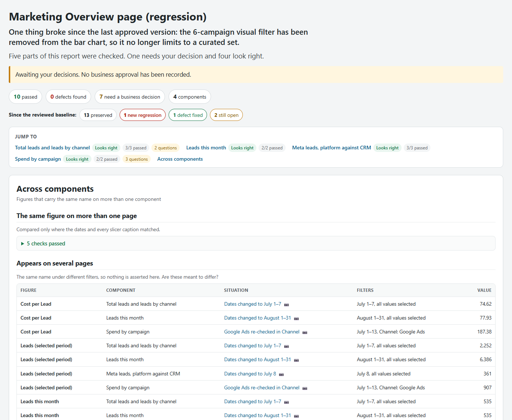

# Measure QA Community Harness

**Put an AI agent to work on the QA you never have time for: it applies the
community's own testing methods to your dashboard, hands you evidence your
stakeholders can read and sign, and leaves a regression suite that catches what
your next change breaks.**

A Claude Code plugin — skills, Python tools and a shared knowledge base — for the
people who have to stand behind the numbers. The agent takes a Power BI report
apart, stress-tests it the way a senior analyst would, shows you what it saw, asks
the questions a reviewer would ask, and seals the whole thing so the next version
of the report can be measured against it. Open source, MIT, built by
[Ask-Y](https://ask-y.ai) with and for the Measure community.

What you get out of it:

- **The QA gets done.** The agent drives the report, runs the queries and writes
  the evidence. You review, you do not click.
- **Expert method, not guesswork.** A catalog of the failure modes that actually
  bite marketing analytics — fan-out, ratio-of-averages, clock-driven flags,
  timezone day boundaries, campaign windows, mix shifts — plus statistics over the
  full series, applied per component.
- **Something a stakeholder can read.** Screenshots, figures and plain questions,
  not DAX. One page, signed or rejected per component, with the evidence sealed
  behind it.
- **A regression suite for your BI.** Every review becomes the baseline for the
  next change, so BI gets tested the way software does.
- **The community behind it.** Each review can publish what it learned, anonymised
  and approved by you, into a knowledge base the next review searches first.

> Installs as the `analytics-qa` plugin, so every skill is `/analytics-qa:…`.

---

## Start here

```text
/plugin marketplace add Ask-Y-Data-Products/measure-qa-harness
/plugin install analytics-qa@ask-y-analytics-qa
```

Open a **working copy** of your report in Power BI Desktop with the debugging port:

```powershell
$env:WEBVIEW2_ADDITIONAL_BROWSER_ARGUMENTS = "--remote-debugging-port=9333"
& "$((Get-AppxPackage Microsoft.MicrosoftPowerBIDesktop).InstallLocation)\bin\PBIDesktop.exe" C:\qa\my-report\working\my-report.pbix
```

Put three small files in a project folder (`connection.json`, `pilot.json`,
`context.md` — two minutes, [the exact contents are here](https://github.com/Ask-Y-Data-Products/analytics-qa/blob/main/docs/INSTALL_AND_TEST.md)),
start Claude Code in it, and ask:

```text
/analytics-qa:investigate Review this report. Cover the Leads, Velocity and P&L
pages, one baseline / change / reset cycle each, run the detectors, and finish
with cases/first-review-signoff.html.
```

Half an hour later you open one HTML page, look at the screenshots and the
figures, and press **Sign off** or **Reject** per component.

Requirements: Windows with Power BI Desktop, Python 3.13, Claude Code. BigQuery
or Azure SQL access is optional and read-only. The harness never refreshes, saves
or edits the report.

---

## Why this exists

Dashboards are never done.

You build one, or an agent builds one for you, or you rebuild a Power BI report on
another platform, or you change a single measure to fix a complaint. Every time,
the same three questions: does it still work, does it say the same as before, did
the fix break something else?

And even when nobody touches the report, the data moves under it. New campaigns
are named differently, a feed skips a week, a timezone shifts a day, a segment
stops reporting. A dashboard that was right in June is quietly wrong in August.

AI made changing dashboards cheap. With an MCP server or a chat, a rebinding or a
new measure takes a minute. Verifying it still takes an afternoon of clicking that
nobody has, so the check gets skipped and the report drifts.

We hit this twice at Ask-Y: our agents build analytics apps, and we convert Power
BI dashboards to Prism. We needed a validation tool an agent can drive and an
analyst can trust, and a regression tool that says exactly what changed.

Software solved this decades ago with test suites nobody argues about. BI never
did, because the checks live in people's heads: this card should equal that table,
this ratio cannot exceed one, this month should not move when I change the date
filter. This harness writes those checks down, has an agent run them, and keeps
the result. And because the checks are the same everywhere, it only makes sense as
a community project — every team letting an agent near a dashboard needs them.

---

## What it finds

Here is a real page from the anonymised report that ships with the project. The
CRM says Meta produced 133 leads on 7 July; the platform's own export says 60. The
ratio line goes through 100% and keeps going.



Nobody watching a dashboard notices that on a Tuesday. A ratio-stability probe with
an upper bound of 1.0 does, on every day of the series at once. In one 32-minute
run on that report the harness also found:

| What the analyst sees | How it was caught |
| --- | --- |
| 5,942 inquiries dated on the wrong day | The day-boundary probe run twice: zero mismatches in UTC, 5,942 in the reporting timezone |
| 534 contracts with a value of zero or less | A data rule the agent wrote from the component's own definition |
| 1,674 spend rows attributed outside their campaign's active window | Campaign-window alignment against the campaign dimension |
| A monthly chart that ignores the page date slicer | A baseline / change / reset cycle: the dates moved, that visual did not |
| 22 measures and columns whose value depends on the machine clock | Deterministic model lint, raised as questions rather than verdicts |
| The same figure reading 48 on one page and 68 on another | The cross-component comparison, which reads every page's captures together |

---

## What the analyst actually gets

One HTML page, per component, self-contained if you want to mail it.



Read it top to bottom, the way you would check the report yourself:

- **What this shows** — one plain sentence. The DAX lives behind a disclosure
  triangle, not in your face.
- **Situations** — every state the agent captured, titled by what it did
  ("Dates changed to August 1–13"), with the filters, the key figures and the
  screenshot. Click any screenshot for the full-size view.
- **What we observed** — one row per situation: dates, filters, every figure, the
  change against the baseline, and whether the reset landed back where it started.
  Every row opens its screenshot.
- **Checks** — computed from the captures, never asserted by the agent: the reset
  returned to the baseline, the change actually moved the numbers, it moved in a
  possible direction, the card equals the table total, the ratio card equals its
  two inputs, every figure matched an independent calculation.
- **Questions for you** — the only thing you have to answer. "Is it expected that
  CRM leads sometimes exceed platform-reported leads?"
- **Sign off / Reject** with a comment, per component. Your decisions export to a
  file pinned to the sealed evidence.

And because the same number lives on more than one page, the harness reads the
pages together:



Behind the page sits the **capture**: a sealed, hash-verified record of every
screenshot, observation, receipt, query and claim. It is what you hand to an agent
to fix the problem, and the baseline the next regression is measured against.



---

## See the actual output

These are the real pages from one run on the anonymised report in this repository.
Nothing was written by hand; open them and click around.

| Report | What it answers | Who reads it |
| --- | --- | --- |
| [How it works](https://ask-y-data-products.github.io/measure-qa-harness/demo/how-it-works.html) | How is this dashboard actually built: screen label to measure to table to source column, page by page | Whoever inherited the report |
| [Findings](https://ask-y-data-products.github.io/measure-qa-harness/demo/findings.html) | What is wrong with it, ranked, each with the question to settle it | Whoever has to fix it |
| [Sign-off page](https://ask-y-data-products.github.io/measure-qa-harness/demo/signoff.html) | What we saw in each situation, what checks out, what needs your decision | The analyst or stakeholder who signs |
| [Capture report](https://ask-y-data-products.github.io/measure-qa-harness/demo/capture-report.html) | The sealed evidence behind every claim: screenshots, observations, receipts, queries | An auditor, or the agent asked to fix it |
| [Regression report](https://ask-y-data-products.github.io/measure-qa-harness/demo/regression.html) | What the last change broke, preserved or fixed, with negative controls | The person approving the change |

---

## How it works

Six skills, each answering a different question and each leaving a report you can
use on its own. They share one case, so later steps build on earlier evidence,
but you can stop after any of them.

| Skill | The question | What it produces | Needs |
| --- | --- | --- | --- |
| **`/analytics-qa:investigate`** | How does this thing work? | **How it works** report | the file and, optionally, the warehouse |
| **`/analytics-qa:evaluate`** | Do the numbers behave? | captured situations, checks and receipts | the live report open in Desktop |
| **`/analytics-qa:detect`** | What is wrong with it anyway? | **Findings** report | the engine; never touches the UI |
| **`/analytics-qa:capture`** | What is the evidence, and do you sign? | **Capture report** + **sign-off page** | the case so far |
| **`/analytics-qa:regress`** | What did the change break? | **Regression report** | the baseline case and the changed report |
| **`/analytics-qa:retrospective`** | What should everyone else learn? | an anonymised article for the knowledge base | your approval |

They stay separate because they need different access and answer different
questions. `detect` runs on a report you cannot drive; `evaluate` needs the live
window; `investigate` needs neither the engine nor the UI. Run the ones you need.

| Skill | What happens |
| --- | --- |
| **`/analytics-qa:investigate`** | You point at a report, and optionally at a page, a component or a worry. The agent reads the report definition, the semantic model and the warehouse SQL behind it, takes screenshots, and traces every visual and filter back to its source. It opens a case. Nothing is proven yet. |
| **`/analytics-qa:evaluate`** | It designs experiments and runs them on the live report, one observed step at a time, each figure checked against an independent DAX or SQL calculation. Baseline, one discriminating change, reset. A card against its table, a ratio against its inputs, the same figure on two pages, a stable period against a volatile one. A step whose receipt fails stops the run. |
| **`/analytics-qa:detect`** | The failure-mode catalog: fan-out through joins, members that do not add up, clock-driven date flags, ratios computed as averages of ratios, events outside campaign windows, timezone day boundaries, weekday-adjusted spikes, level shifts, mix changes. Deterministic lint plus statistics over the full series, each flag explained with a query or left as an explicit question. |
| **`/analytics-qa:capture`** | Everything becomes a sealed case and the sign-off page you just saw. |
| **`/analytics-qa:regress`** | Point it at the changed report. It replays the baseline and classifies every expectation: preserved, expected change pending review, new regression, defect fixed, still open, inconclusive. Untouched pages are negative controls. |
| **`/analytics-qa:retrospective`** | Turns what this review taught into an anonymised article for everyone else. See below. |

The agent never hand-writes the deliverable. Runs that fail a receipt cannot be
attached, the case structure is written only by the tools, the sign-off page
carries a generator stamp, and an external evaluator judges the result from
outside the session — because an agent's "all done" is not evidence.

---

## When something changes

We took the same report, rebound one column of one table from `Leads` to
`New Inquiries` — heading, query name and display name all left saying "Leads" —
and asked a fresh session to find out whether anything broke. It was not told
what had changed.

Twenty-seven minutes later: **3 new regressions, 14 preserved, 15 still open**,
one visual definition file differing out of 252, and this card.



It did not stop at "the number moved". It proved which layer moved — the engine
still returns the old measure, the screen shows the new one — checked that the
slicer and the date range still work on the rebound column, confirmed the other
five pages replay identically, and handed back one sentence for the report owner:
the table now silently excludes reinquiries while still labelled "Leads",
understating the count by about 12%.

---

## The community part

Every team using AI on dashboards learns the same lessons alone. This turns them
into a shared asset:

1. After a review, `/analytics-qa:retrospective` digests the session and the case
   **on your machine**. That digest never leaves it.
2. It drafts an article: the symptom, how it was detected, the root cause, the
   data-model or DAX rule that avoids it, and what made the work faster. Client
   names, people, paths, ids and absolute business figures are stripped, and a
   residual scan lists whatever a human still has to judge.
3. You read it, edit it, approve it. Only then is it published to
   [analytics-qa-knowledge](https://github.com/Ask-Y-Data-Products/analytics-qa-knowledge),
   tagged with topics and indexed.
4. The next `investigate` or `detect`, on anyone's machine, searches that base
   first: *"conversion rate Meta reporting gaps"*, *"campaign window alignment"*.

Point `kb.json` at your own repository if your articles should stay internal.

We think community harnesses like this are how we all keep control of agents that
touch analytics: shared rules, shared failure modes, shared evidence of what
actually works — and everyone free to take from it and give back.

---

## Principles

- **Observe before acting.** A click attempt is not a state change. Every capture
  carries a hash-bound receipt of the fields it asserts.
- **Engine and screen are both evidence.** DAX results and rendered pixels are
  compared; neither substitutes for the other.
- **Never touch the report under test.** No refresh, no save, no edit.
- **A seal proves integrity, a receipt proves fields, only you prove truth.** No
  approval is ever fabricated; an unattended run ends "awaiting review".
- **Fail loudly.** A tool that refuses leaves nothing behind, and an exit code of
  zero is not a result.

## Repository layout

```
plugins/analytics-qa/
  skills/        investigate, evaluate, detect, capture, regress, retrospective
  scripts/       pbi.py, pbi_cycle.py, qa.py, probes.py, model_lint.py, stats_lib.py,
                 review_form.py, analyst_view.py, retrospective.py, …
  detectors/     catalog.json (20 failure modes), METHODS.md
  references/    case format, Power BI playbooks, knowledge-base contract
  retrospective/ topic vocabulary
```

| Repository | What is in it |
| --- | --- |
| this one | the plugin, installable from the marketplace |
| [analytics-qa](https://github.com/Ask-Y-Data-Products/analytics-qa) | tests, synthetic fixture, unattended runner, external evaluator, install and trial guides |
| [analytics-qa-knowledge](https://github.com/Ask-Y-Data-Products/analytics-qa-knowledge) | the community articles and their index |

## Contributing

Issues and pull requests are welcome. Good first contributions: a new detector
(an entry in `detectors/catalog.json`, a method in `probes.py` or `stats_lib.py`,
and a test), control mechanics for slicer types we do not drive yet, playbooks for
other BI hosts, and articles through the retrospective.

Keep customer material out of anything you push. The redaction tooling is a
checklist for a human, not a guarantee.

MIT licensed. Version: `plugins/analytics-qa/.claude-plugin/plugin.json`.
